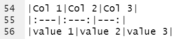
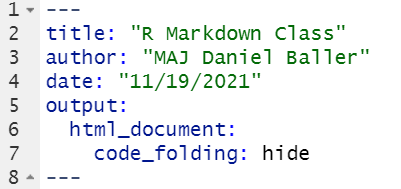
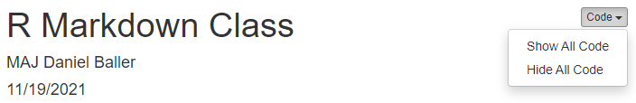

```{r setup, include=FALSE}
knitr::opts_chunk$set(echo = FALSE)
library(fontawesome)
```

## Intent

**This Class has 1 main objective:**

-   Learning the basics of R Markdown and why it's so **Awesome**

```{r, echo=FALSE,out.width="40%", out.width="90%",fig.cap="caption",fig.show='hold',fig.align='center', fig.cap = " "}
knitr::include_graphics(c("./images/hedgehog.PNG"))
```


These slides serve to be a stand alone document to walk you through step
by step what was covered in the live briefing.

<center>
<font size="2">

Image by Allison Horst

</font>
</center>

## Necessary Packages

-   knitr
-   rmarkdown
-   tidyverse (only for adding elements to the document)

<br>
<br>

```{r, echo=FALSE,out.width="40%", out.width="20%",fig.cap="caption",fig.show='hold',fig.align='center', fig.cap = "   "}
knitr::include_graphics(c("./images/knitr.PNG","./images/rmarkdown.PNG",
                          "./images/tidyverse.PNG"))
```

## What is Markdown and R Markdown

[Markdown]{.underline} is a lightweight markup language for creating
formatted text using a plain-text editor.

[R Markdown]{.underline} provides an unified authoring framework for
data science, **combining your code, its results, and your prose
commentary.** R Markdown documents are fully reproducible and support
dozens of output formats, like PDFs, Word files, slideshows, and more.

<font size="4">

**Benefits:**

1) Saves time

2) Transparent

3) Reproducible
                 

For more information on R Markdown check Hadley Wickham's book [R for Data Science](https://r4ds.had.co.nz/r-markdown.html) or [The R Markdown Cookbook](https://bookdown.org/yihui/rmarkdown-cookbook/)

</font>

## Creating an R Markdown file

1.  In Rstudio Select `File` at the top left
2.  Select `New File`
3.  Select `R Markdown`
4.  Choose `Document` from the menu on the left
5.  Give your file a name in the "Title:" field.
6.  Select your default output. I always start with `HTML`.
7.  Select `Ok`

## R Markdown sections

<font size="5">

### Yaml

-   Metadata for your document
-   allows for setting the output and other key document setting
-   Begins and ends with a line of three dashes `(---)`

### White space

-   Plain text field
-   Allows for your analysis to be presented with the code and output

### Code Chuncks

-   Grey sections that begin and end with three \`\`\`
-   Can support R, Python, Bash, D3, Rcpp, SQL, Stan, ...

</font>

## The White Space \| Organization

<font size="4">

Headers can help keep your document organized and create and easy way to
jump between sections of your document.

-   Each header is denoted with a using pound signs with `#` being the
    largest header and `######` being the smallest.
-   You can also add a horizontal line in your document to separate
    sections by adding 3 asterisks `(***)`

</font>

```{r, echo=FALSE,out.width="40%", out.height="15%",fig.cap="caption",fig.show='hold',fig.align='center', fig.cap = "   "}
knitr::include_graphics(c("./images/Organization_code.PNG","./images/Organization_output.PNG"))
```

## The White Space \| Text Formating

### Markdown

```{r, echo=FALSE,out.width="40%", out.height="20%",fig.cap="caption",fig.show='hold',fig.align='center', fig.cap = "   "}
knitr::include_graphics(c("./images/text_format_code.PNG","./images/text_format_output.PNG"))
```

-   HTML and Latex also supported for text formatting.

## The White Space \| Equations

#### In-line equations

**Code:** Markdown provides the ability to add inline equations using
latex such as `$y = mx + b^2$` to sections of text.

**Output:** Markdown provides the ability to add inline equations using
latex such as $y = mx + b^2$ to sections of text.

#### Display Equations

**Code:** Display equations can also be added by using two `$$` on
either side of the equation like this: `$$y = mx + b^2$$`

**Output:** Display equations can also be added by using two `$$` on
either side of the equation like this: $$y = mx + b^2$$

## The White Space \| Tables

<font size="3">

-   "\|" is used to separate columns, i.e "\|column 1\|Column 2\|".
-   A set of dashes are used to separate the header from the body of the
    table i.e. "\|- - -\|- - -\|"
-   ":" is used to justify the column: left justified = "\|:- - -\|",
    right justified = "\|- - -:\|", centered = "\|:- - -:\|"

Code:



Output:

</font>

| Col 1   |  Col 2  |   Col 3 |
|:--------|:-------:|--------:|
| value 1 | value 2 | value 3 |

## Visual Editor

<font size="4">

If you are more comfortable using Microsoft Word than R the visual
editor in R Studio can be a great resource. The visual editor provides a
word-like interface to edit your markdown document and will add the
markdown or html code to your source document.

To access the visual editor select the `visual` button in the top left
corner of the source panel shown below.

<center>{width="150px"}</center>

\

This will render your document and provide a word-like toolbar below the
standard R Studio toolbar.

<center>{width="600px"}</center>

\

After you are finished in the visual editor, selecting the `source`
button will bring you back to your code and any changes you made in the
visual editor will be coded for you.

More info on the visual editor can be found
[HERE](https://rstudio.github.io/visual-markdown-editing/) </font>

## Code Chunks

<font size="5">

-   All code needs to be in a code chunk to be evaluated.
-   Each chunk starts and ends with three ```` (```) ```` (the accent
    mark by your esc key)
-   The beginning will also have `{r}` to indicate that it is an r code
    chunk
-   Additional options can be added inside the curly braces to change
    how the chunk is evaluated or how output is displayed. A full list
    of options can be found [HERE](https://yihui.org/knitr/options/)
-   Comments can be added to your code chunk with the `#` just like in
    an R script.
-   It is good practice to name your code chunks. Two philosophies on
    this are to name each chunk based on what that chunk is doing or
    what the main output of the chunk is.

</font>

## Code Chunks Cont....

Each code chunk has a gear icon in the top right corner. This icon will
allow you to name your your code chunk and change how it is evaluated.

The following output options available in the drop down menu allow you
to customize what code is shown in your final report and what code is
run in the background but not displayed.

-   Show output only
-   Show code and output
-   Show nothing (run code)
-   Show Nothing (don't run code)

## Code folding

<font size="4">

Updating lines 5-7 of the YAML header as shown below allows for your
code to be folded into your document. This will hide your code initially
and add a show code button at the location of each code chunk.

</font>



<font size="4">

A code button will also be added at the top right of the knitted
document that will that allow you to show or hide all code chunks in the
document.

</font>



## Questions

Any questions or comments on this class please feel free to reach out
at:

<center>


[danielpballer](https://github.com/danielpballer)


[\@danielpballer](https://twitter.com/danielpballer)


[daniel.p.baller.mil\@army.mil](mailto:daniel.p.baller.mil@army.mil){.email}


[danielballer.usma\@gmail.com](mailto:danielballer.usma@gmail.com){.email}

</center>
